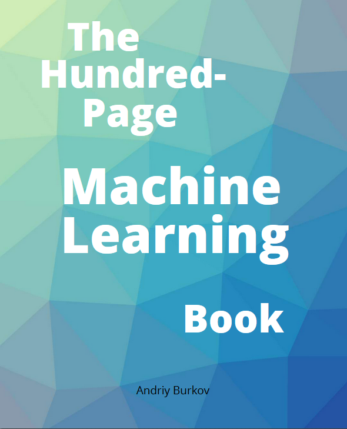

# 百页机器学习小书

> 原书：[The Hundred-Page Machine Learning Book](http://themlbook.com/)
> 
> 欢迎任何人参与和完善：一个人可以走的很快，但是一群人却可以走的更远。

* [ApacheCN 机器学习交流群 629470233](http://shang.qq.com/wpa/qunwpa?idkey=30e5f1123a79867570f665aa3a483ca404b1c3f77737bc01ec520ed5f078ddef)
* [ApacheCN 学习资源](http://www.apachecn.org/)

## 目录

+   零、前言
+   一、介绍
+   二、符号和定义
+   三、基本算法
+   四、线性算法剖析
+   五、最佳实践
+   六、神经网络和深度学习
+   七、问题和答案
+   八、高级实践
+   九、无监督学习
+   十、其它学习形式
+   十一、总结

## 负责人

* [@飞龙](https://github.com/wizardforcel): 562826179

## 贡献指南

[请见这里](CONTRIBUTING.md)

> 请您勇敢地去翻译和改进翻译。虽然我们追求卓越，但我们并不要求您做到十全十美，因此请不要担心因为翻译上犯错——在大部分情况下，我们的服务器已经记录所有的翻译，因此您不必担心会因为您的失误遭到无法挽回的破坏。（改编自维基百科）

## 赞助我们

