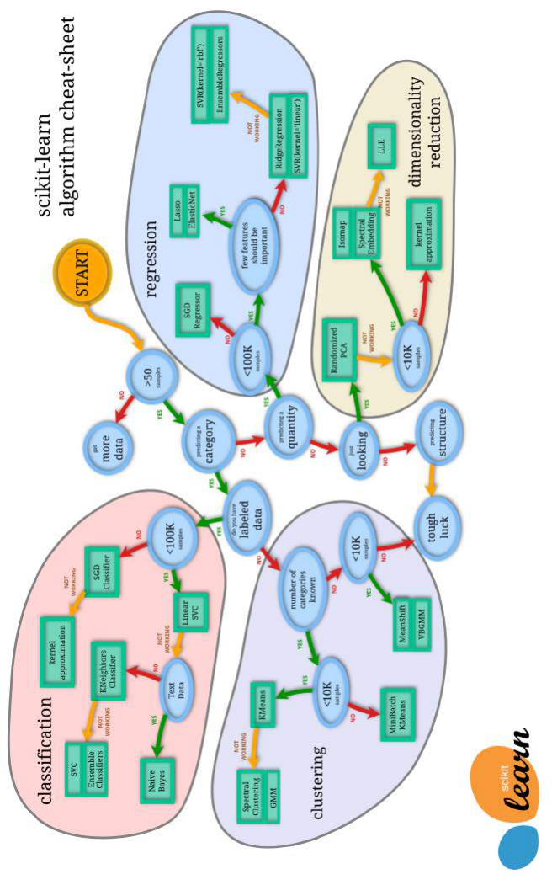
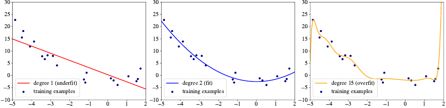
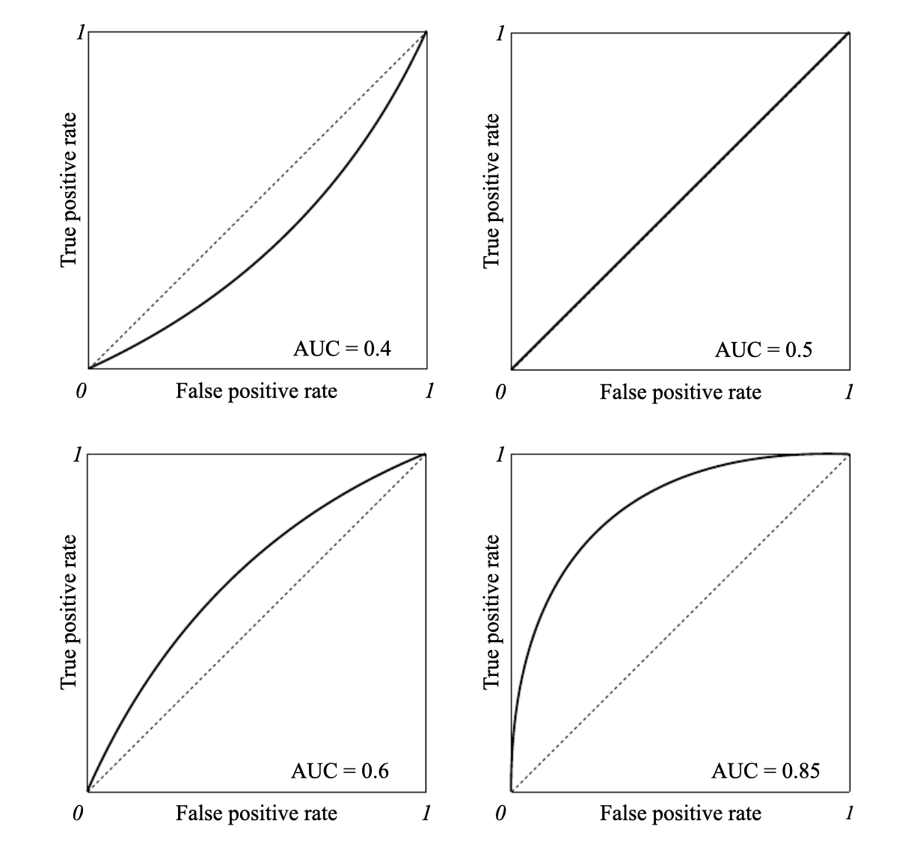

# 5 基础实践

译者：[@chengchengbai](https://github.com/chengchengbai)

直到现在，我也只是顺便提到了数据分析师在处理机器学习问题时可能遇到的一些问题：特征工程，过拟合，以及超参数调优。在本章，我们将会谈谈这样那样的一些挑战，这些挑战是你在 scikit-learn 中键入 $model =  LogisticRegresion().fit(x,y)$ 之前需要被解决的。

## 5.1 特征工程

当产品经理跟你说：“我们要能预测一个特定的客户是否会继续留下，这里有他五年间使用我们的产品的日志。”你不能只是直接把这些数据塞进一个库然后得到预测结果，你首先要建一个**数据集**(dataset)。

还记得第一章里头讲的，数据集是**带标记样本**(labeled examples)的集合 $\{( \bold{x}_i,y_i)\}_{i=1}^{N}$，这 $N$ 个里面的每一个元素 $\bold{x_i}$ 被称为**特征向量**( feature vector )。特征向量的每一个维度 $j=1,…,D$ 都是以某种方式来描述这个样本的，这些值被称为**特征**( feature )，用 $x^{(j)}$ 表示。

将原始数据转换为数据集的问题称为特征工程。 对于大多数实际问题，特征工程是一个体力活，同时也需要数据分析师的创造力，当然，有领域知识就更好了。

举个栗子，为了将用户与某计算机系统交互的日志转换为数据集，我们需要创造一些特征，这些特征包含用户信息以及各式各样的从日志中提取出来的统计信息。对于每一个用户，一个特征可以包含订阅价格，其他的特征可以包含每天，每周，每年的连接频率，还有另外的特征包含平均会话的时长是多少秒，或者一个请求的平均响应时长，等等。任何可以计量的东西都可以被用作特征。数据分析师的角色就是建立*富含有用信息*( *informative* )的特征：这些特征能够让学习算法构建一个在训练数据上表现良好的模型。含有丰富信息的特征也被称为具有高*预测力*( *predictive power* )的特征。比如用户会话的平均时长（译者注：可以理解为用户的平均使用时长）对于预测用户将来是否还会继续使用这个应用就具有高预测力。

当一个模型在训练数据集上预测很准的话，我们称这个模型有**低偏差**( low bias )。也就是说当我们尝试预测用于构建这个模型的样本的标签时，模型仅会犯很少的错误。（译者注：原文此处比较啰嗦，核心意思就是说在训练数据上表现良好的模型是低偏差的）

### 5.1.1 热编码 ( One-Hot encoding )

一些学习算法只能处理数值型的特征向量，当你数据集中有一些特征是类别型的时候，比如“颜色”或者“星期几”，你可以将这样一个变量转换为几个二值的变量。

如果你的样本有一个类别型特征“颜色”并且这个特征总共有三个可能的取值：“红”，“黄”，“绿”，那么你就可以将这个特征转换为一个具有三个数值特征的向量：
$$
\begin{aligned} red &=[1,0,0] \\ yellow &=[0,1,0] \\ green &=[0,0,1] \end{aligned} \tag{1}
$$
通过这样做，你增加了你的特征维数。但你不能直接将红转为 1，黄转为 2，绿转为 3 来避免维数的增加，因为这样做就暗示了这个类别内的不同值有了大小顺序之分，而这个指定的顺序对后面的决策十分重要。如果特征值的大小顺序本身并不重要，用这种有序的数值就很有可能迷惑学习算法[^1]，因为算法将会试图寻找本来不存在的规律，这有可能导致过拟合。

[^1]: 类别型变量的值的大小有意义的话，我们就可以用数字来替换变量的值，这样就保持了这个特征跟以前一样只用一个变量表示了。比如，如果我们的变量表示文章的质量，取值是 $\{ poor,decent,good,excellent\}$，然后我们就可以用数字来代替这些类别，比如 $\{ 1,2,3,4\}$。

### 5.1.2 分箱 ( Binning )

有一种相反的情况，在实际中出现得较少，就是你想要将数值型特征转换为类别型。**分箱**( binning，也叫分段 bucketing )是将连续特征转换为多个二进制特征（称为箱或桶）的过程，通常基于（原始特征的）取值范围。比如，相较于直接把年龄表示成单个实值数字特征，数据分析师可以将年龄范围划分为离散的区间（箱）：0到5岁可以放入一个区间（箱），6到10年之间可以放到第二个箱，11到15岁可以在第三个箱里，依此类推。

举个栗子：假如我们的特征 $j=18$ 表示年龄。通过分箱操作，我们将这些特征用对应的箱来代替。假设我们有三个新的箱，"age_bin1","age_bin2","age_bin3" 以及他们分别对应的索引 $j=123,j=124,j=125$ ，现在，如果对于某些样本点 $\bold{x}_i$ 其特征 $x_i^{(18)}=7$，那我们就将特征 $x_{i}^{(124)}$ 设置为1，如果 $x_i^{(18)}=13$ 就将特征 $x_{i}^{(125)}$ 设为1，其他也如此。

在某些情况下，精心设计的分箱策略可以帮助学习算法使用更少的样本。 之所以发生这种情况，是因为我们对学习算法给出了“暗示”，即如果特征的值落在特定范围内，则该特征的确切值是无关紧要的。

### 5.1.3 归一化 ( Normalization )

**归一化**( normalization )是指将一个数值型特征的实际取值范围转换到一个标准范围内的处理过程，一般是转换到 $[-1,1]$ 或则 $[0,1]$ 。

比如，假设有个特征的取值范围是350到1450，通过对每个值都减去350，然后除以1100，我们就能将这些特征的值归一化到 $[0,1]$ 。

更通俗来讲，归一化的公式长这样：
$$
\overline{x}^{(j)}=\frac{x^{(j)}-m i n^{(j)}}{max^{(j)}- min ^{(j)}} \notag{}
$$
其中 $max^{(j)}$ 和 $ min ^{(j)}$ 分别表示数据集中第 $j$ 个特征的最大值和最小值。

那么问题来了，为啥要归一化呢？数据归一化并不是严格要求的。 但是在实践中，它可以提高学习速度。 记得前面章节中讲到的梯度下降的例子， 想象一下，你有一个二维特征向量，当你更新参数 $w^{(1)},w^{(2)}$ 时，你要用均方误差( average squared error )关于 $w^{(1)},w^{(2)}$ 的偏导数，如果 $x^1$ 取值 $[0,1000]$ 而 $x^2$ 取值 $[0,0.0001]$，这将导致取值大的那个特征将对更新起到决定性作用。

此外，确保我们的输入都大致处于相同的相对较小的范围内是十分实用的，这可以避免计算机在处理非常小或非常大数字时遇到的问题（称为流量数据）。

### 5.1.4 标准化 ( Standardization )

标准化( standardization，又称 z-score 归一化 )，是指将特征的值进行缩放，从而使得其具有*标准正态分布*( $\mu = 0, \sigma = 1 $ )性质的操作，其中 $\mu$ 表示均值（数据集中所有样本关于这个特征的平均值），$\sigma$ 表示关于均值的标准差。

特征的标准分数（又称z分数）是按如下这样计算的：
$$
\hat{x}^{(j)}=\frac{x^{(j)}-\mu^{(j)}}{\sigma^{(j)}} \notag
$$
你可能会问啥时候该使用归一化啥时候该使用标准化呢。 这个问题没有明确的答案。 通常情况下，如果的的数据集不是太大并且你有时间，那么你可以两种都试一下看哪一个更适合你的任务。

如果你没有很多时间进行试验，以下是几条经验：

- 对于无监督学习，在实践中，标准化通常要好于归一化。
- 如果特征的值分布接近正态分布（所谓的钟形曲线），则标准化也是特征的首选;
- 同样的，标准化也更适用于可能会取到极大或极小值（外点）的特征，因为规范化会将规范值“挤压”到一个非常小的范围内。
- 在其他情况下，规范化更好一点

当然，你可以在一些流行的库里面找到的现代实现的学习算法，都对不同范围的特征鲁棒，特征缩放通常对大多数学习算法是有益的，不过在很多情况下，直接用原始特征训练的模型效果也很好。

### 5.1.5 处理缺失值

在某些情况下，分析人员拿到的数据都是特征已经被定义好了的。 在一些样本中，一些特征的值可能会缺失。 这通常发生在数据集是手工制作的时候，制作人员忘记填写某些值或根本没有进行测量。

通常，处理缺失值得方法包括：

- 移除那些有值缺失的样本点，当然，前提是你的数据集足够大，这样就可以牺牲一些训练样本
- 使用那些可以应对缺失值的算法（这取决于库以及算法的特定实现）
- 使用数据插补技术

### 5.1.6 数据插补技术

一种技术是用数据集中该特征的平均值替换缺失的特征值：
$$
\hat{x}^{(j)}=\frac{1}{N} x^{(j)} \notag
$$
另一种技术是将缺失值都替换为正常范围值之外的相同值。比如，如果正常范围是 $[0,1]$ 那么你就能将缺失值替换成 2 或者 -1 ，这背后的思想是：学习算法将学习当特征具有与其他值明显不同的值时最好做什么。另外一种方法是，你可以用取值范围中间的那个值替换缺失值，比如，如果特征的取值范围是 $[-1,1] $ 那么你可以将缺失值设为 0，这背后的思想是，如果我们用中间值来替换缺失值得话，不会对预测有太大影响。

更高级的技术是使用缺失值作为回归问题的目标变量。你可以用所有的剩余的特征$\left[x_{i}^{(1)}, x_{i}^{(2)}, \ldots, x_{i}^{(j-1)}, x_{i}^{(j+1)}, \ldots, x_{i}^{(D)}\right]$ 来建立一个特征向量 $\hat{\bold{x}}_i$ ，令 $\hat{y}_i =x^{(j)}$ ，其中 $j$ 是有缺失值的特征，现在我们就可以建立一个回归模型利用 $\hat{\bold{x}}$ 来预测 $\hat{y}$ ，当然为了构建这样的训练样本 $(\hat{\mathbf{x}}, \hat{y})$ 你只需要使用那些原始数据集中 $j$ 特征有值存在的样本就好了。

最后，如果你有一个非常大的数据集，并且只有一小部分特征有缺失值，你可以通过对每个有缺失的特征增加一个二值标识符特征来增加维度。假设在 $D$ 维数据集上 $j=12$ 有缺失值，那么对于每个特征向量 $\bold{x}$ ，你可以增加一个特征 $j=D+1$ ，当第12个特征值未缺失时，这个（新加的）特征设为1，否则为0，缺失的特征值随后可以用0或你任选的数来替换。

在预测时，如果样本也是不完整的，那么你应该使用跟在训练时相同的数据插补技术来填充缺失值。

在开始研究学习问题之前，你无法确定哪种数据插补技术是最好的。 尝试几种技术，多建立几个模型并选择其中最好的。

## 5.2 学习算法的选择

选择机器学习算法可能是一项艰巨的任务。 如果你有很多时间，你可以所有的都试一遍。然而通常你要解决问题的时间有限。 在开始解决问题之前，你可以问自己几个问题。 根据你的答案，可以将一些算法列入候选名单并对开始用你的数据进行尝试。

- 可解释性

你的模型是否需要对非技术受众好解释？很多非常精准地学习算法被称为“黑盒”，它们能学到只犯极少错误的模型，但是为什么模型会做出特定的预测则非常难理解更别说解释。这样的模型有如神经网络和集成模型。

另一方面，kNN，线性回归或决策树这样的学习算法得到的模型通常并不是最准的，但是它们却能以一种非常直接的方式做预测。

- 内存内还是内存外

你的数据集能被完整地加载进服务器或者个人电脑的内存吗？如果是的，那么你可以选择非常多的算法，否则，你最好用增量式的学习算法，增量式算法能通过一点点地增加数据来提升模型效果。

- 特征和样本的数量

你的数据集中有多少个训练样本？ 每个样本有多少特征？ 一些算法，包括**神经网络**和**梯度提升**（我们后来都考虑过），可以处理大量的样本和数百万特征。 其他的比如SVM，其能力可能就比较一般。

- 类别型 vs 数值型特征

你的训练样本是全部只有类别型特征，还是全部只含数值型特征，还是两者混合？根据你的回答，一些学习算法不能直接处理你的数据集，你需要将你的类别型特征转换为数值型特征，比如使用类似热编码的方式。

- 数据的非线性

你的数据时线性可分的吗，换句话说，你的数据能否用线性模型建模？如果是的，那么线性核的SVM，逻辑回归或者线性回归就是不错的选择。否则，深度神经网络或者集成学习算法（在第6，第7章中讨论的）会更适用于你的数据。

- 训练速度

允许用多长的时间来训练模型？ 众所周知，神经网络训练很慢。 像逻辑和线性回归这样的简单算法以及决策树学得要快得多。 一些专业库包含一些算法的非常高效的实现; 你可能更喜欢多上网瞅瞅以找到这样的库。 一些算法，例如随机森林，可以使用多CPU核心加速，因此在具有数十个CPU核心的机器上，它们模型构建的时间可以显著减少。

- 预测速度

在预测的时候模型要有多快？你的模型是否会用在有高吞吐量需求的环境上？一些算法，比如 SVM，线性回归和逻辑回归，或者某些类型的神经网络，做预测非常地快，其他一些算法比如 kNN，集成算法和深度神经网络后者循环神经网络，就会慢一些[^2]。

[^2]: kNN 和集成方法在当今的库里的实现预测速度还是很快的，所以在实践中不要怕去使用这些算法。

 
图1：scikit-learn机器学习算法选择示意图

## 5.3 三个集合

直到现在，我认为“数据集”和“训练数据”这两种表述是可互换的，然而，在实际的中，数据分析师通常会跟三个带标签的样本集合打交道：

1. 训练集
2. 验证集
3. 测试集

一旦获得了带标注的数据集，你首先要做的事情是将样本分成三个子集：训练集，验证集和测试集，训练集通常是最大的那个，你可以用它来构建模型，验证集和测试集的大小大致相同，比训练集要小很多。学习算法不能使用这两个集和内的数据进行建模，这也是为什么这两个集合通常被称为**保留集** (hold-out sets)。

没有最佳的切分比例来切分这三个集合，过去的经验法则是 70% 的数据集用作训练，15%用于验证，15%用于测试，然而，在大数据时代，数据集通常含有数百万个样本，在这种情况下，持95％的训练集和2.5％/ 2.5％的验证/测试集是合理的。

你也许会好奇，为什么要分为这三个集合而不是只有一个，答案很简单：当我们构建模型时，我们不想模型只对那些已经看到过标签的样本上表现很好，一个记住所有训练样本然后用记忆进行预测的简单算法在训练集上将不会有任何错误，但这样的算法在实际中却是无用的，我们真正想要的是我们的模型预测表现的很好，当遇到学习算法没有看到过的例子时。 因此，我们希望在保留集上获得良好的表现。

为什么我们需要两个保留集呢？我们将使用验证集来 1）选择学习算法， 2）寻找超参数的最优值。在将模型交付或者投入生产前，我们使用测试集来评估模型。

## 5.4 欠拟合与过拟合

上文中我提到了**偏差**（bias）这个概念。我们说当模型在训练数据上预测得很准时，模型的偏差就很小。如果模型在训练数据上犯了很多错误，则我们就说模型有高偏差，或者模型欠拟合。所以，欠拟合指的是模型没法在训练数据上预测得很准，欠拟合通常有很多原因，下面的是最重要的：

- 你的模型对数据而言太简单了（比如线性模型经常欠拟合）
- 你设计的特征没有足够的信息量

第一点在一维回归的例子下很好展示：数据集可能是一条曲线，但我们的模型是一条直线。第二个点可以这么解释：假设你想要预测一个病人是不是有癌症，你有身高，血压和心率这些特征，显然这三个特征对于癌症来说并不是很好的预测因子，所以我们的模型将无法学到特征和标签之间有意义的关系。

欠拟合的解决方案是尝试更加复杂的模型或者使用更加具有预测意义的特征。

过拟合是模型可能出现得另一个问题。过拟合的模型在训练集上表现得非常好，但是至少在两个保留集中的一个上表现得很差。我之前已经在第3张给出了过拟合的一个例子。好几个原因会导致过拟合，其中最重要的是：

- 你的模型对于数据来说太复杂了（比如非常高的决策树或者非常深或者广的神经网络通常会过拟合）
- 你有太多的特征，但是却只有很少的训练数据

在学术文献中，你可以找到过拟合问题的另外一个名字：高方差问题，这个术语来自于统计学。方差是模型的误差，因为它对训练集中的小波动很敏感，这意味着如果你的训练数据是以不同的方式被采样的话，训练的学习过程将会导致截然不同的模型，这也是为什么过拟合的模型会在测试集上表现很差：测试数据和训练数据是从不同的数据集中独立采样的。

过拟合问题的几个可能的解决方法：

1. 尝试更简单的模型（线性代替多项式回归，或者线性核的 SVM 而不是 RBF核，更少层数/神经元的神经网络）
2. 减少数据集中样本的维度（比如，使用第9章中讨论的降维技术）
3. 如果可能的话，使用更多的训练数据
4. 正则化模型

左：欠拟合，中：拟合良好，右：过拟合

图2：欠拟合（线性模型），良好拟合（二次模型），过拟合（多项式模型）的例子

图2展示了一个一维数据集，回归模型是如何欠拟合，良好拟合，过拟合这个数据集的。

正则化是最常使用的防止过拟合的手段。

## 5.5 正则化( Regularization )

即使是最简单的模型，比如线性模型，也会过拟合数据。这通常发生在数据的维度很高但训练样本特相对少的情况。实际上，当特征向量是很高维的时候，线性学习算法会构建一个这样的模型：该模型将会分配非零值给参数向量 $\bold{w}$ 中的大多数维度 $w^{(j)}$ ，试图找到所有可能的特征之间的复杂关系，来完美预测训练样本的标签。

这样复杂的模型通常可能在保留集上表现较差，这是因为模型努力去预测训练样本的同时，也会学到训练集的特点：训练集特征值中的噪声，小数据量的采样缺陷，以及存在于训练集中的其他的外在人工决策问题。

**正则化**是一个总结性的术语，围绕那些强制使学习算法构建一个更加不复杂的模型的方法展开。在实践中，这通常会使偏差稍微高一点，但能显著降低方差。这个问题在文献中通常被称为偏差-方差权衡。

最常用的两种类型的正则化称为 $\bold{L1}$ 正则化和 $\bold{L2}$ 正则化，其思想非常简单，为了创建正则化了的模型，我们修改一下目标函数，加上一个惩罚项，如果模型越复杂的话惩罚项的值就越高。

简单起见，我以线性回归作为一个正则化的例子，相同的原则也适用于其他很多模型。

回想一下线性回归，我们想最小化以下式子：
$$
\min _{\mathbf{w}, b} \frac{1}{N} \sum_{i=1}^{N}\left(f_{\mathbf{w}, b}\left(\mathbf{x}_{i}\right)-y_{i}\right)^{2}  \tag{2}
$$
加上 $\bold{L1}$ 正则化后目标函数长这样：
$$
\min _{\mathbf{w}, b} C|\mathbf{w}|+\frac{1}{N} \sum_{i=1}^{N}\left(f_{\mathbf{w}, b}\left(\mathbf{x}_{i}\right)-y_{i}\right)^{2}  \tag{3}
$$
其中 $|\mathbf{w}| \stackrel{\mathrm{def}}{=} \sum_{j=1}^{D}\left|w^{(j)}\right|$ ， $C$ 作为控制正则化重要性的超参数。如果将 $C$ 设为零，模型就会变成标准的无正则项的线性回归模型。另一方面，如果我们将 $C$ 设为很大，学习算法就会试图将大多数 $w^{(j)}$ 设为更小的值或者零以求最小化目标函数，这样模型就会变得非常简单，会导致欠拟合。你作为数据分析师，需要寻找这样一个合适的参数 $C$ ，使得偏差不会增太多，但是可以显著减少过拟合。在下一节，我将会告诉你如何去做。

一个 $L2$ 正则项长这样子：
$$
\min _{\mathbf{w}, b} C\|\mathbf{w}\|^{2}+\frac{1}{N} \sum_{i=1}^{N}\left(f_{\mathbf{w}, b}\left(\mathbf{x}_{i}\right)-y_{i}\right)^{2}, \quad \text { where }\|\mathbf{w}\|^{2} \stackrel{\text { def }}{=} \sum_{j=1}^{D}\left(w^{(j)}\right)^{2} \tag{4}
$$
在实际中，$L1$ 正则化会产生稀疏模型，稀疏模型的大多数参数（在线性回归的例子里就是大多数的 $w^{(j)}$）都是零(假设超参数 $C$ 足够大的话，所以 $L1$ 其实做了**特征选择**，通过决定哪些特征对预测来讲是重要的，哪些是不重要的，这一点在你想提高模型解释性的时候很有用，不过，如果你只是想最大化模型在保留集上的效果的话，$L2$ 正则化要好一点，$L2$ 通常是可微的，所以梯度下降能够用来优化目标函数。

$L1$ 和 $L2$ 也会组合起来用，在 $L1$ 和 $L2$ 取一些特殊情况下称为**弹性网正则化**。你可以找到一些名为 $L2$ 脊回归，

$L1$ lasso 回归的文献。

除了被广泛运用在线性模型上以外，$L1$ 和 $L2$ 也常被用在神经网络和其他模型上，用来直接最小化目标函数。

神经网络也收益于其他两种正则化技术：**dropout** 和 **batch-normalization**，也有一些非数学手段也起到正则化的作用，比如数据增强（data augmentation）和提早停止（ early stopping），我们将在第8章讨论这些技术。

## 5.6 模型效果评估

一旦你用训练数据构建了一个模型，你将如何描述你的模型到底有多好？你可以用测试集来评估模型。

测试集包含了那些学习算法之前从未见过的样本，如果我们的模型在测试集里的样本上预测表现很好，我们就称模型*泛化性*很好，或者简单点讲，就是模型很牛逼。

更加严格来说，机器学习专家用各种形式的指标和工具来评估模型性能。对于回归，模型的评估十分简单，一个拟合良好的模型的预测结果会非常接近于观测值。均值模型，就是总是预测训练数据平均值的模型，通常如果没有一些比较有信息特征的时候我们将会使用这个模型。回归模型的拟合评价应该，至少也得比均值模型要好，如果这个条件满足，那么下一步就是就是比较模型在训练数据和测试数据上的效果。

为了干这件事，我们计算分别计算训练数据和测试数据的均方差[^3]（mean square error, MSE），如果模型在测试数据上的MSE明显高于训练数据上的，这是过拟合的标志，正则化和其他的超参数调优方法可以解决这个问题，“明显高于”的含义取决于你手中的问题并且需要数据分析师和决策者，拥有模型的产品owner联合决定。

[^3]:或者你用来构建模型的其他类型的损失函数

对于分类任务而言，事情会有一点点复杂，评价分类任务时使用的最广泛的指标和工具是这些：

- 混淆矩阵（confusion matrix）
- 准确率（accuracy）
- 损失敏感准确率（cost-sensitive accuracy）
- 精确率（precision）/召回率（recall）
- ROC曲线下面积（area under the ROC curve，AUC）

为了简化问题，我这里用一个二分类问题举例，在必要的地方，我会告诉你如何扩展到多分类的场景下。

### 5.6.1 混淆矩阵

混淆矩阵是一个总结了分类模型预测类别成功程度的表。混淆矩阵的一个轴是模型预测的标签，另一个轴是真实标签，在二分类问题中，就有两类。我们假设：模型预测两个类别：“垃圾邮件”和“非垃圾邮件”：

|                          | 垃圾邮件（预测值） | 非垃圾邮件（预测值） |
| :----------------------- | :----------------- | :------------------- |
| **垃圾邮件（真实值）**   | 23 ( TP )          | 1 ( FN )             |
| **非垃圾邮件（真实值）** | 12 ( FP )          | 556 ( TN )           |

上面的信息显示，有 24 个样本确实是垃圾邮件，模型成功分类出来 23 个，在这种情况下，我们称有 23 个**真正类**（**True positive**）或者 $\mathrm{TP}=23$ . 模型将一个样本误分类成非垃圾邮件，在这种情况下，我们有 1 个 **假负类**（**False negative**）或者 $\mathrm{FN} = 1$. 同样的，我们有 568 个样本不是垃圾邮件，模型正确分类出 556 个（ 556 **真负类 True negative**，$\mathrm{TN}=556$），有 12 个错误分类的（12 **假正类 False positive**， $\mathrm{FP}=12$）

多分类问题的混淆矩阵有很多行和列，代表不同的类别。它能帮助你确定误分类的模式。举个栗子：一个混淆矩阵可以揭示训练用于识别动物的模型更倾向于错误地预测“猫”而不是“黑豹” 或 “鼠标”而不是“老鼠”，在这种情况下，你可以决定增加这些类别的带标签的训练样本，来帮助学习算法更多地见识它们之间的不同，或者，你可以决定添加一些新的特征，使得学习算法可以用这些特征来构建一个能更好地区分这些类别的模型。

混淆矩阵可以用来计算两个重要的效果指标：**精确率**（precision）**和召回率**（recall）

### 5.6.2 精确率/召回率

两个最常用的评价指标，来评估模型好坏的就是精确率和召回率，精确率是预测正确的正类占所有预测正类中的比例：
$$
\text { Precision }=\frac{\mathrm{TP}}{\mathrm{TP}+\mathrm{FP}} \notag
$$
召回率是预测正确的正类占所有真正类的比例：
$$
\text { Recall }=\frac{\mathrm{TP}}{\mathrm{TP}+\mathrm{FN}} \notag
$$
为了理解精确率和召回率在模型评估中的意义和重要性，将预测问题视为查询数据库中的文档的问题通常是有用的。精确率就是在返回的文档列表中，相关文档所占的比例。召回率就是搜索引擎所返回的相关文档占所有数据库中相关文档的比例。

在垃圾邮件检测的例子中，我们希望有高的精确率（我们想要避免误将合法的邮件分类成垃圾邮件），我们可以容忍低一些的召回率（我们可以容忍收件箱中有一些垃圾邮件）。

往往在实践中，我们需要在高精确率和高召回率之间进行选择，二者兼顾是不太可能的，我们可以通过一些方式实现其中二者中的一个：

- 通过赋予垃圾邮件信息更多的权重（SVM算法接受类别权重作为输入）
- 通过调优超参数，取在验证集上有最大精确率或召回率的超参
- 通过变化返回类别概率的算法的决策阈值，比如：如果我们用逻辑回归或者决策树，为了增加精确率（代价是更低的召回率），我们可以定义：只有在模型返回的概率大于0.9时才预测为正

即使精确率和召回率是为二分类场景下定义的，你也可以用它来评估多分类问题，为此，首先选择要评估的类，然后将此类作为正类，剩余的类作为负类。

### 5.6.3 准确率 ( Accuracy )

准确率是这样计算出的：正确分类的样本个数除以总的分类的样本个数，从混淆矩阵的角度而言：
$$
\text { Accuracy }=\frac{\mathrm{TP}+\mathrm{TN}}{\mathrm{TP}+\mathrm{TN}+\mathrm{FP}+\mathrm{FN}} \tag{5}
$$
当每个类别的预测误差都很重要时，准确率是一个是一个十分有用的指标，在判断是否为垃圾邮件的例子并不符合这个情况。比如：相比于假负类，你更不能容忍假正类。垃圾邮件检测中的假正类情形是这样的：当你的朋友给你发送一封邮件时，模型将其标记为垃圾邮件然后没有给你正常显示，另一方面，假负类通常并不构成什么严重问题，如果你的模型没有检测出一小部分的垃圾邮件，那也没什么。

### 5.6.4 代价敏感准确率

为了处理不同类别有不同重要性的情况，一个有用的指标是代价敏感准确率 ( Cost-Sensitive Accuracy ) ，为了计算代价敏感准确率，你首先得赋一个cost（一个正整数）给两种误判的类型：FP和FN，然后正常计算TP, TN, FP, FN ，最后在计算准确率之前，将FP和FN乘上之前赋的值就好了。

### 5.6.5 ROC曲线下面积 ( AUC )

ROC曲线（ROC，receiver operating characteristic，受试者工作特征，这个术语来自于雷达工程）是一个常用的用来评估分类模型性能的方法。ROC曲线结合真正率（正确预测的正类样本比例，准确定义为召回率）和假正率（错误预测的负类样本比例）来构成分类效果的概要说明。

真正率和假正率分别定义如下：
$$
\mathrm{TPR}=\frac{\mathrm{TP}}{(\mathrm{TP}+\mathrm{FN})} \text { , } \mathrm{FPR}=\frac{\mathrm{FP}}{(\mathrm{FP}+\mathrm{TN})} \notag
$$
ROC曲线只能被用来评估那些返回预测类别的置信度（或者说概率）的分类器。比如，逻辑回归，神经网络，决策树（基于决策树的集成模型）就可以用ROC曲线评估。

为了画出一条 ROC 曲线，我们首先将置信分数的区间范围离散化。如果我们模型的这个区间是 $[0,1]$ ，我们就可以将其离散化为 $[0,0.1,0.2,0.3,0.4,0.5,0.6,0.7,0.8,0.9,1]$ ，然后我们用这些离散值作为预测的阈值，然后用这些离散值作为预测的标签。举个栗子：如果我们想计算关于阈值 0.7 的 $\mathrm{TPR}$ 和 $\mathrm{FPR}$ ，我们首先将每个样本都输入模型，然后对于得到的预测分数如果大于等于0.7，我们就将其作为正类，反之就是负类。

图3：ROC曲线下面积

如图3所示，很容易观查到，如果阈值为0，我们所有的预测结果都是正类，所以 $\mathrm{TPR}$ 和 $\mathrm{FPR}$ 都为1（右上角），相反的，如果阈值为1，那么预测结果就不会有正类， $\mathrm{TPR}$ 和 $\mathrm{FPR}$ 都是0，对应图中的左下角。

ROC曲线下面积  ( AUC ) 越大，分类器就越好。一个ROC曲线下面积大于0.5的分类器好于随机分类器，如果ROC曲线下面积小于0.5，则你的模型一定是哪里出问题了。一个完美的分类器的AUC是1。通常，如果我们的模型表现良好，我们通过选取使得 $\mathrm{TPR}$ 接近 1 而 $\mathrm{FPR}$ 接近 0 的阈值来获得一个好的分类器。

ROC曲线由于比较好理解而被广泛使用，它能捕获分类效果多个层面（通过将假正类和假负类都考虑进去），并且能够可视化地比较不同模型的效果。

## 5.7 超参数调优

当我展示学习算法的时候，我提到了这一点：你作为数据分析师必须选择好的算法超参数，比如 $\mathrm{ID3}$ 的 $
\epsilon$ 和 $d$ ，$\mathrm{SVM}$ 的 $C$ ，或者梯度下降的 $\alpha$ ，但是，这些具体意味着什么呢？那个值是最好的，如何寻找它？在这一节，我将回答这些基础的问题。

正如你之前就知道的，学习算法的超参数不会自己优化，数据分析师需要通过实验来一个个地寻找最优参数值的组合，来“调节”这些超参数。

一个典型的做法是，当你有足够多的数据来搞出像样的验证集时（验证集中每个类至少有一些样本）并且超参数的范围不会很大可用用**网格搜索**的时候。

网格搜索是一个最简单的超参数调优方法，假设你训练一个 $\mathrm{SVM}$ ，有两个超参数要调：惩罚参数 $C$ 和 核（linear或者rbf）的选择。

这是你头一次使用这个数据集，你不知道 $C$ 的可能的取值范围，最通常的做法是用对数范围，比如对于 $C$ 你可以尝试这些取值：$[0.001, 0.01, 0.1, 1.0, 10, 100, 1000]$ 。这个情况下你有 14 个超参数的组合要尝试 [(0.001, “linear”), (0.01, “linear”), (0.1, “linear”),(1.0, “linear”), (10, “linear”), (100, “linear”), (1000, “linear”), (0.001, “rbf”), (0.01, “rbf”), (0.1, “rbf”), (1.0, “rbf”), (10, “rbf”), (100, “rbf”), (1000, “rbf”)]​。

你使用训练数据训练这14个模型，每个超参数的组合对应一个模型，然后你在验证集上使用我们之前讨论的评价指标来评估这些模型的效果（或者你在意的一些评价指标），最后，你根据评价指标留下最好的那个模型。

当找到最佳超参数组合后，你可以在试着用这些最佳值周围的值来尝试一下，这样做有时能有更好的结果。

最后，你用测试集来评估你选择出的模型。

正如你注意到的，尝试枚举所有超参数的组合时时很耗时的，尤其是当超参数组合很多时或者数据集很大的时候。这里有一些更加高效的技术：**随机搜索**和**贝叶斯超参优化**。

随机搜索区别于网格搜索的地方在于，你不需要提供离散的参数值的集合来探索每个超参数，而是为提供每个超参数提的统计分布，超参数是从中随机采样出来的，并设置要尝试的组合总数。

贝叶斯方法区别于随机搜索和网格搜索：它用之前的评估结果来选择下一次要评估的参数值，这个想法是根据过去表现得很好的结果来选择下一个超参数值，以用来限制昂贵的目标函数优化。 

还有基于梯度的技术，进化优化技术和其他超参数调优技术，大部分现代的机器学习库都实现了一种或多种此类技术，当然也有一些其他的库超参数调整库几乎可以帮你调整一切学习算法，包括你自己编写的算法（译者注：详见上面的二维码）。

### 5.7.1 交叉验证 ( Cross Validation )

当你没有合适的验证集来调优你的超参数，能帮到你的常见技术是**交叉验证**，当你只有比较少的训练样本时候，想要都拥有验证集和测试集是不太可能的，你更希望用比较多的数据去训练模型。在这种情况下，你只需要将数据集划分为训练集和测试集，然后在训练集上采用交叉验证来模拟验证集。

交叉验证是像如下这样工作的：首先，你固定要评估的超参数，然后将训练集分为几个相同大小的子集，每个子集称为一个折( fold )，在实践中典型的是5折( five-fold )交叉验证。使用5折交叉验证，你随机将训练集划分为5个子集：$\left\{F_{1}, F_{2}, \ldots, F_{5}\right\}$，每个$F_{k}, k=1, \dots, 5$ 含有20%的训练数据，每个然后你依次训练5个模型：对于模型 $f_1$ 你使用 $ F_2, F_3, F_4$ 和 $F_5$ 作为训练数据，然后使用 $F_1$ 作为验证集，第二个模型 $f_2$ 你使用 $F_1,F_3,F_4,F_5$ 作为训练数据，$F_2$ 作为验证集，然后依此继续迭代地构建模型，然后计算相关评价指标的在对应验证集的值，从 $F_1$ 到 $F_5$ ，然后将这5个值的平均值作为最后的值。

你能使用带交叉验证的网格搜索来寻找模型的最优参数，一旦你寻找到了这个最佳参数，你就可以用整个数据集和这个最好的参数来构建模型了，最后，你用测试集来评估模型。